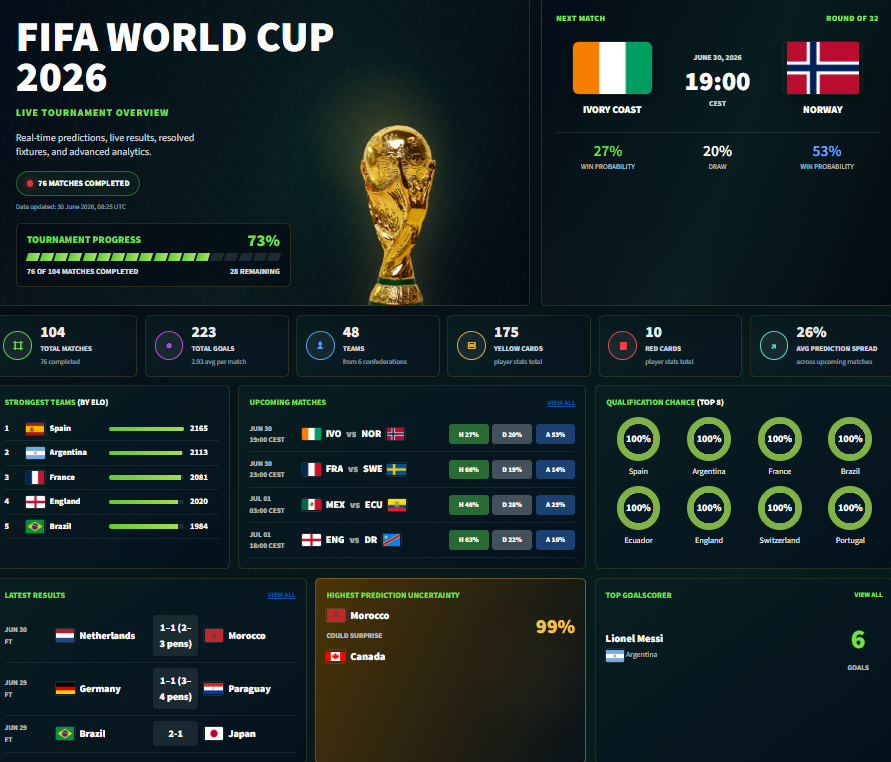

# FIFA World Cup 2026 Match Prediction

## 📺 Dashboard Preview

⚽ FIFA World Cup 2026 Analytics & Prediction Platform

An end-to-end football analytics platform that combines historical match data, Elo-based team strength modeling, and predictive analytics to deliver interactive insights for FIFA World Cup 2026.

The project transforms raw football data into interactive dashboards, performance insights, and match probability visualizations using a structured data pipeline and statistical modeling.

🎯 Project Objective

The main goal of this project is to:

Analyze international football performance trends
Evaluate team strength using historical and Elo-based metrics
Provide match outcome probabilities for World Cup 2026 fixtures
Build an interactive analytics dashboard for exploration and decision support
Centralize football data into a clean, reusable analytics pipeline
👨‍💻 My Role (Data Analyst)

In this project, I contributed as a Data Analyst, focusing on transforming raw football data into meaningful insights and interactive visual analytics.

🧩 My responsibilities included:
📊 Designing and building the Streamlit analytics dashboard
🧹 Cleaning, structuring, and validating football datasets for analysis
⚽ Creating match-level and team-level analytical views
📈 Developing visual insights for team performance and tournament progression
🧠 Working with Elo ratings and statistical outputs to support interpretation
📉 Building interactive charts for match probabilities and comparisons
🔍 Ensuring data consistency across historical, live, and prediction datasets
📺 Supporting storytelling through data visualization and dashboard UX design
📊 Key Features
Interactive Streamlit dashboard for World Cup 2026 analytics
Match outcome probability visualization (Win / Draw / Loss)
Team strength comparison using Elo ratings
Group stage and knockout stage analysis
Live match tracking and updates
Historical performance analysis
Team profile and statistics pages
🧠 Methodology

The project follows a structured analytics workflow:

Data collection (historical + live football data)
Data cleaning and normalization
Feature engineering (team form, Elo difference, matchup context)
Statistical modeling for match probabilities
Data visualization and dashboard development
📊 Data Sources
Historical international match results
FIFA World Cup 2026 team & fixture data
Elo rating dataset for team strength estimation
Live match data from football-data.org
Player statistics (StatBunker)
📺 Dashboard Sections
📌 Overview (tournament summary & KPIs)
⚽ Matches (predictions & results)
📊 Groups (group stage analysis)
🏆 Knockout bracket visualization
👥 Team analysis pages
🚧 Future Improvements
🎲 Monte Carlo tournament simulation (100,000+ iterations)
📊 Enhanced KPI tracking for teams
🤖 Comparison of statistical vs ML-based models
🌍 Real-time injury & squad updates integration
📱 Improved UI/UX for mobile dashboard
🧰 Tech Stack

Python · Pandas · Streamlit · Plotly · NumPy · Scikit-learn · football-data.org API

🧭 Project Summary

This project demonstrates how raw sports data can be transformed into a structured analytics system that supports interactive exploration, performance comparison, and predictive insights for football tournaments.
